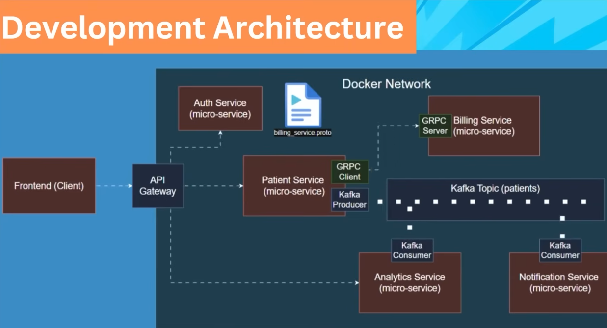

# Patient Management System

A microservices-based patient management system built with Spring Boot, featuring inter-service communication via gRPC and Kafka, JWT authentication, and API Gateway routing.

## Architecture Overview


## Technology Stack

| Category | Technology |
|----------|-------------|
| Framework | Spring Boot 4.0.x |
| Language | Java 21 |
| API Gateway | Spring Cloud Gateway 2025.1.1 |
| Database | PostgreSQL |
| Message Broker | Apache Kafka |
| Inter-service | gRPC 1.69.0 |
| Authentication | JWT (jjwt 0.12.6) |
| Documentation | OpenAPI (springdoc) |
| Container | Docker, Docker Compose |

## Services Overview

### 1. API Gateway (port 4004)
Entry point for all client requests. Routes to backend services and performs JWT validation for protected endpoints.

**Responsibilities:**
- Route requests to appropriate services
- JWT token validation for protected endpoints
- Request/response transformation

**Endpoints:** All requests handled via routes to services.

---

### 2. Patient Service (port 4000)
Core service for patient management with CRUD operations.

**Responsibilities:**
- Patient CRUD operations
- Integration with billing service via gRPC
- Event publishing to Kafka

**Endpoints:**

| Method | Endpoint | Description |
|--------|----------|-------------|
| GET | `/api/patients` | Get all patients |
| GET | `/api/patients/{id}` | Get patient by ID |
| POST | `/api/patients` | Create new patient |
| PUT | `/api/patients/{id}` | Update patient |
| DELETE | `/api/patients/{id}` | Delete patient |

**Database:** PostgreSQL (port 5432)

---

### 3. Auth Service (port 4005)
Authentication and JWT token management service.

**Responsibilities:**
- User authentication
- JWT token generation
- Token validation

**Endpoints:**

| Method | Endpoint | Description |
|--------|----------|-------------|
| POST | `/api/auth/login` | Generate JWT token |
| GET | `/api/auth/validate` | Validate JWT token |

**Database:** PostgreSQL (port 5432)

---

### 4. Billing Service (port 4001 HTTP, 9001 gRPC)
Handles billing account management via gRPC.

**Responsibilities:**
- Billing account creation (via gRPC)
- Billing operations

**gRPC Method:**
- `CreateBillingAccount(BillingRequest) returns (BillingResponse)`

---

### 5. Analytics Service (port 4002)
Consumes patient events from Kafka for analytics purposes.

**Responsibilities:**
- Kafka event consumption
- Event processing and analytics

---

### 6. Integration Tests
Test suite for integration testing across services.

---

## Environment Configuration

Create a `.env` file in the project root:

```env
# Database Configuration
DB_NAME=db
DB_USER=admin_user
DB_PASSWORD=password
DB_PORT_INTERNAL=5432
PATIENT_SERVICE_DB_PORT_EXTERNAL=5000
AUTH_SERVICE_DB_PORT_EXTERNAL=5001

# Service Ports
PATIENT_SERVICE_PORT=4000
BILLING_SERVICE_HTTP_PORT=4001
BILLING_SERVICE_GRPC_PORT=9001
ANALYTICS_SERVICE_HTTP_PORT=4002
API_GATEWAY_HTTP_PORT=4004
AUTH_SERVICE_HTTP_PORT=4005

# Docker Container Url
AUTH_SERVICE_URL=http://auth-service:4005

# Jwt Secret Key
JWT_SECRET=your-secret-key-here

# Kafka Configuration
KAFKA_PORT_EXTERNAL=9092
KAFKA_PORT_DEVELOPMENT=9094
SPRING_KAFKA_BOOTSTRAP_SERVERS=kafka:9092
SPRING_KAFKA_CONSUMER_GROUP-ID=analytics-service
SPRING_KAFKA_CONSUMER_AUTO-OFFSET-RESET=earliest

# Spring Specific
JPA_DDL_AUTO=update
SQL_INIT_MODE=always
```

## Setup & Running

### Prerequisites
- Java 21
- Docker & Docker Compose
- Maven

### Option 1: Run with Docker Compose

```bash
# Build and start all services
docker-compose up -d

# View logs
docker-compose logs -f

# Stop all services
docker-compose down
```

### Option 2: Run Locally with Maven

```bash
# Build each service
cd patient-service && mvn clean package -DskipTests
cd auth-service && mvn clean package -DskipTests
cd billing-service && mvn clean package -DskipTests
cd analytics-service && mvn clean package -DskipTests
cd api-gateway && mvn clean package -DskipTests

# Run each service
cd patient-service && mvn spring-boot:run
cd auth-service && mvn spring-boot:run
# ... etc
```

## API Documentation

Once services are running, access Swagger UI at:

| Service | Swagger URL |
|---------|-------------|
| Patient Service | `http://localhost:4000/v3/api-docs` |
| Auth Service | `http://localhost:4005/v3/api-docs` |

## Inter-Service Communication

### gRPC Communication
Patient Service communicates with Billing Service via gRPC:
- Patient created → gRPC call to Billing Service → Billing Account created

### Kafka Communication
Patient Service publishes events to Kafka:
- Patient created/updated → Event published to Kafka → Analytics Service consumes

### REST Communication
API Gateway validates JWT tokens via auth-service:
- Request with token → API Gateway → auth-service validate endpoint

## Project Structure

```
patient-management/
├── .env                    # Environment variables
├── docker-compose.yml        # Docker compose configuration
├── README.md              # This file
├── patient-service/        # Patient CRUD service (REST + gRPC client + Kafka producer)
├── auth-service/         # Authentication & JWT service
├── billing-service/      # Billing service (gRPC server)
├── analytics-service/   # Analytics service (Kafka consumer)
├── api-gateway/         # API Gateway with JWT validation
├── integration-tests/    # Integration tests
└── docs/               # Documentation (Postman collections)
```

## Ports Summary

| Service | HTTP Port | gRPC Port | Database Port |
|---------|-----------|-----------|---------------|
| api-gateway | 4004 | - | - |
| patient-service | 4000 | 9001 (outgoing) | 5432 |
| auth-service | 4005 | - | 5432 |
| billing-service | 4001 | 9001 | - |
| analytics-service | 4002 | - | - |
| kafka | 9092 | - | - |

## Security

- JWT tokens are generated by auth-service
- API Gateway validates tokens before routing to protected services
- Token validation endpoint: `GET /api/auth/validate` with `Authorization: Bearer <token>` header

## Testing

```bash
# Run integration tests
cd integration-tests
mvn test
```

## License

This project is for learning microservice architecture. 
I learned from Chris Blakely. Here is the YouTube link: https://www.youtube.com/watch?v=tseqdcFfTUY&t=20646s 