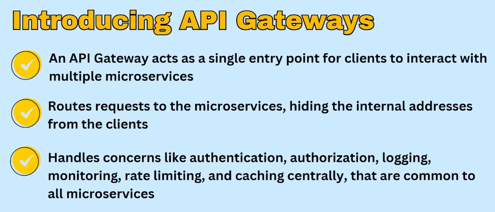
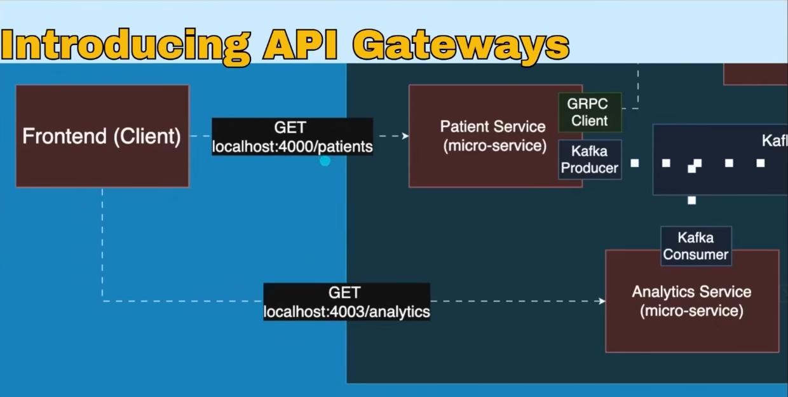
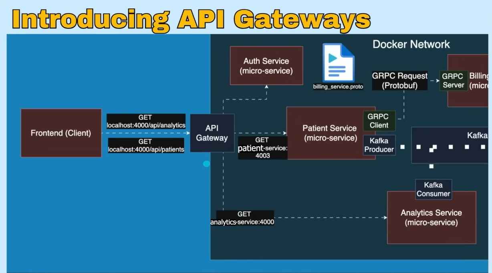
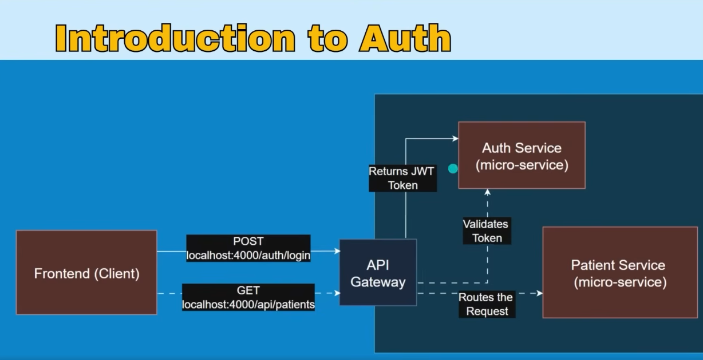
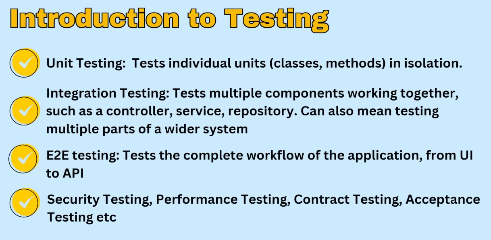

What I learn in this project

- Production-Ready Patient Management System with Microservices
- Java, Spring boot & docker microservices
- Postgres Database
- Load Balancers & API Gateways to route requests
- Event driven communication - Kafka
- Real time communication - rest & grpc
- Authenticate Users & Secure APIs using bearer tokens
- Integration test
- Deploying to AWS using localstack and infrastructure as code

Introduction API Gateways

- An API Gateway acts like as a single entry point for clients to interact with multiple microservices
- Routes requests to the microservices, hiding the internal addresses from client
- Handles concerns like authentication, authorization, logging, monitoring, rate limiting and caching centrally that are common to all microservices

If not use API Gateway

If use API Gateway

Auth Service

Testing

opencode -s ses_227c0a716ffe226Pd5Qu4dp9OC
  